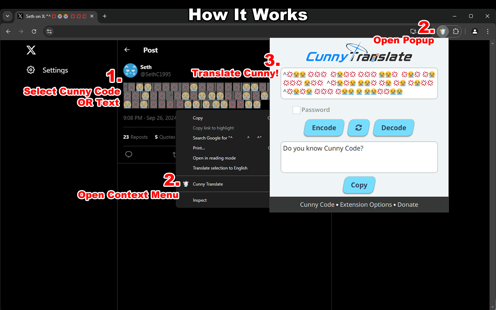
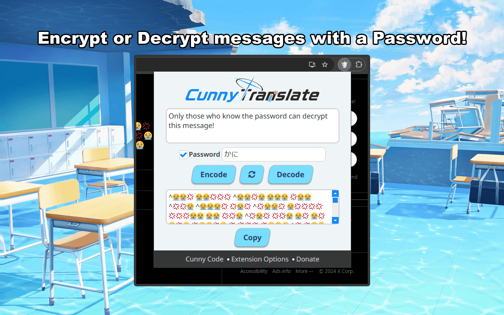
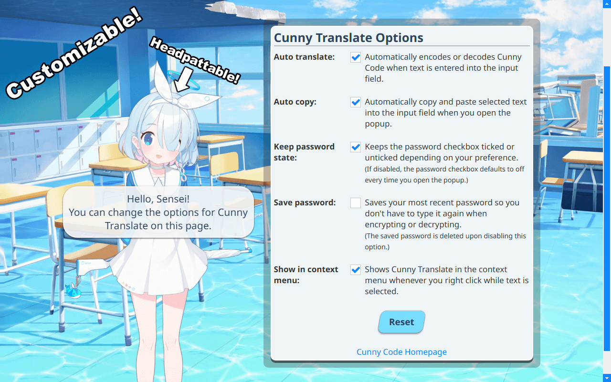

<p align="center"></p>

Cunny Translate is a cute and funny browser extension that lets you easily translate [Cunny Code](https://github.com/SethClydesdale/cunny-code?tab=readme-ov-file#what-is-cunny-code) while browsing the web. You can get it on the Chrome or Firefox extension stores via the links below.

**Google Chrome:** https://chromewebstore.google.com/detail/cunny-translate/phgoiaamiloblcdcfdihfgaklghcbmfe

**Firefox:** https://addons.mozilla.org/en-US/firefox/addon/cunny-translate/

Additionally, you can install Cunny Translate from GitHub. Please see [this section](#how-to-install-cunny-translate-from-github) for a tutorial on how to install this extension from GitHub. 

Once you have it installed, you can give it a try by decoding the following message!

```
^💢 😭😭😭😭 😭💢 💢😭 💢😭💢  💢😭💢💢 💢💢💢 😭😭💢  😭😭💢😭 💢💢💢 😭💢😭  😭😭 💢😭 😭😭😭 💢 😭💢 😭💢😭😭 😭💢😭😭 😭😭 💢😭 💢💢😭  ^💢😭💢😭 😭😭💢 💢😭 💢😭 💢😭💢💢  ^💢 😭💢😭 😭💢 💢😭 😭😭😭 😭💢😭😭 😭💢 💢 😭 💢😭💢😭💢💢
```

For tips and tricks on using this extension, please see the first section below.

-----

**Quick Links**
- [How to Use Cunny Translate](#how-to-use-cunny-translate)
- [How to Install Cunny Translate from GitHub](#how-to-install-cunny-translate-from-github)
- [Suggestions, Feedback, Bug Reports](#suggestions-feedback-bug-reports)
- [Special Thanks](#special-thanks)
- [Donate](#donate)


### How to Use Cunny Translate

Cunny Translate is a fairly straightforward extension for translating to and from [Cunny Code](https://github.com/SethClydesdale/cunny-code?tab=readme-ov-file#what-is-cunny-code).

1. Select/highlight Cunny Code or regular texts with your cursor.
2. Click the extension icon or right click and choose "Cunny Translate" from the context menu.
3. The popup window for the extension should open and automatically translate Cunny Code to English and vice versa.

You can also manually encode or decode with the buttons provided.

<p align="center"></p>

Additionally, you can encrypt your messages with a password, so only those who know the password can decrypt your message. Simply click the checkbox to enable password mode, insert a password, then type your message or hit the encode/decode button!

<p align="center"></p>

Lastly, you can customize the way Cunny Translate works by clicking the "Extension Options" link in the popup window's footer. There's a number of options to customize your experience, so be sure to check out this page first!

<p align="center"></p>


### How to Install Cunny Translate from GitHub
To install Cunny Translate from GitHub, head on over to the [releases page](https://github.com/SethClydesdale/cunny-translate/releases) and grab either **chromium.zip**, if you use Google Chrome, or **firefox.signed.xpi**, if you use Firefox, from the latest release. Installation differs depending on the browser, so follow the instructions for your preferred browser below.

#### Google Chrome
1. Unzip the add-on into a folder somewhere safe.
2. Open Google Chrome and go to the Extensions page.
3. Enable "Developer mode" by clicking the button in the top right of the page.
4. Click "Load unpacked" from the top left.
5. Select the folder where you unzipped Cunny Translate to install it.
6. You're ready to translate Cunny!

#### Firefox
1. Open Firefox and go to the extensions page.
2. Drag and drop the XPI file into the Firefox browser window. **OR** Click the cog icon and choose "Install add-on from file" and select the XPI file.
3. Click "add" in the popup that appears to install Cunny Translate.
4. You're ready to translate Cunny!


### Suggestions, Feedback, Bug Reports
If you have any suggestions, feedback, questions, or bugs to report, feel free to [open a new issue](https://github.com/SethClydesdale/cunny-translate/issues) in this repository so we can correct those naughty bugs💢💢💢 You can also find additional reporting methods [here](https://sethclydesdale.github.io/cunny-code/report/) if you do not have a GitHub account.


### Special Thanks
Cunny Translate was made possible thanks to...
- [morsecode.world](https://morsecode.world/international/morse2.html) for their comprehensive Morse Code resources.
- [nulla2011](https://github.com/nulla2011) for the [Blue Archive Logo Generator](https://github.com/nulla2011/bluearchive-logo).
- [Blue Archive Wiki](https://bluearchive.fandom.com/wiki/Arona/Gallery) and Blue Archive itself for the imagery used in this project.
- [BlueSechi](https://www.youtube.com/watch?v=T9F1Wk8DQdg) for the dancing Arisu.
- [CryptoJS](https://github.com/brix/crypto-js) for the methods used to encrypt messages with a password.
- Google for [Noto Sans](https://fonts.google.com/noto/specimen/Noto+Sans) and [DAJI](https://x.com/daji_nhnyk/status/1840259471819280870) for letting me know the font that Blue Archive uses.
- [FontAwesome](https://github.com/FortAwesome/Font-Awesome) for the awesome icons.
- [13rac1](https://github.com/13rac1) for the [Twemoji](https://github.com/13rac1/twemoji-color-font?tab=readme-ov-file) font so we could achieve that iconic U😭H.
  - The version of the font used in this repo is a COLR/CPAL version from [ctan.org](https://ctan.org/pkg/twemoji-colr) which has support for both Chrome and Firefox.
- The many Senseis who helped support or contribute to this project, whether it was on GitHub or outside of it.


### Donate
If you found this project cute or funny, please see [this page](https://sethclydesdale.github.io/cunny-code/donate/) for ways to support my work.

-----

<div align="center"><a href="https://sethclydesdale.github.io/cunny-code/404"></a></div>
<div align="center">Made with Cunny and Love</div>
